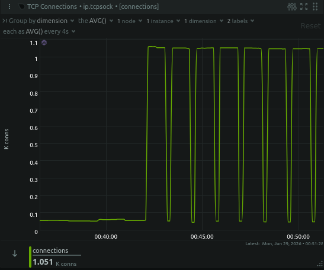
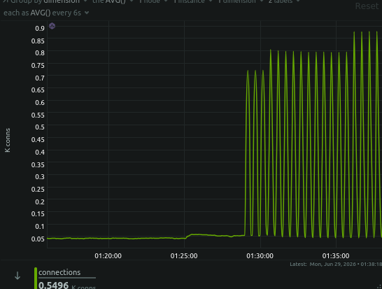
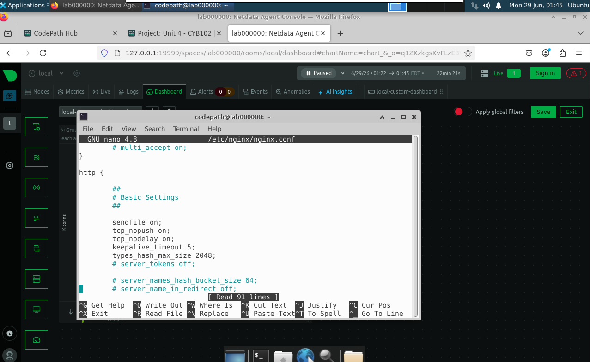

# DoS Attack & Mitigation Lab — Slowloris vs. nginx

A hands-on security lab demonstrating a low-bandwidth Denial-of-Service (DoS) attack and how to defend against it at the web-server layer. A **Slowloris** attack is launched against a local **nginx** server inside a VM, the resulting connection exhaustion is observed in **Netdata**, mitigation rules are added to nginx, and the attack is re-run to confirm the defense works.

> Slowloris doesn't flood the network — it opens many connections and holds them open with deliberately slow, incomplete HTTP requests, exhausting the server's connection pool so legitimate users can't connect. The defense is to make nginx *impatient*: close any connection that doesn't finish its request quickly, and cap how many connections a single IP can hold.

## Tech / Tools

- **nginx** — target web server
- **slowloris-run** — attack tool
- **Netdata** — real-time TCP connection monitoring
- **Ubuntu VM** (RDP access) — isolated lab environment

## Results

| | Unprotected | Protected |
|---|---|---|
| **TCP connections** | Climb to ~1,000+ and **hold** in flat plateaus | Spike briefly, then **collapse** back to ~50 baseline |
| **Server state** | Connection pool saturated — DoS succeeds | Pool never fills — slow connections force-closed |
| **Graph shape** | Sustained high plateaus | Dense sawtooth |

The key difference is **sustained saturation (vulnerable)** versus **connections that open and get force-closed before they can pile up (mitigated)**.

### Screenshots

<!-- Drop your images into a screenshots/ folder and they'll render here -->

**Unprotected attack — connections plateau at ~1,000+**



**Protected attack — connections collapse back to baseline**



**nginx mitigation config**



## Mitigation Applied

Added to the `http {}` block in `/etc/nginx/nginx.conf`:

```nginx
limit_conn_zone $binary_remote_addr zone=addr:10m;
client_header_timeout 5s;
client_body_timeout   5s;
send_timeout          5s;
keepalive_timeout     5;
```

Added to the `server {}` block in `/etc/nginx/sites-available/default`:

```nginx
limit_conn addr 10;
```

The short header/body timeouts are the primary Slowloris killer — nginx drops any connection that doesn't send a complete request within 5 seconds, which is exactly what Slowloris relies on *not* happening. `limit_conn` caps each IP to 10 simultaneous connections so a single source can't monopolize the pool.

Applied with:

```bash
sudo nginx -t && sudo systemctl reload nginx
```

## Documentation

- **[Technical Write-Up](DoS_Lab_Technical_Writeup.pdf)** — full walkthrough: every command, what it does, when it's used, and key takeaways.
- **[Environment Setup Guide](DoS_Lab_Environment_Setup.pdf)** — how to rebuild this lab from scratch and run it again.

## Key Takeaways

- **DoS isn't always about volume.** Slowloris uses almost no bandwidth — it exhausts the connection pool, not the network pipe. Defenses must match the attack type.
- **Generous default timeouts are an attack surface.** Tightening header/body timeouts neutralizes slow-rate attacks directly.
- **Validate before applying** — `nginx -t && reload` should be muscle memory.

---

*CYB102 — Unit 4, Project 4*
